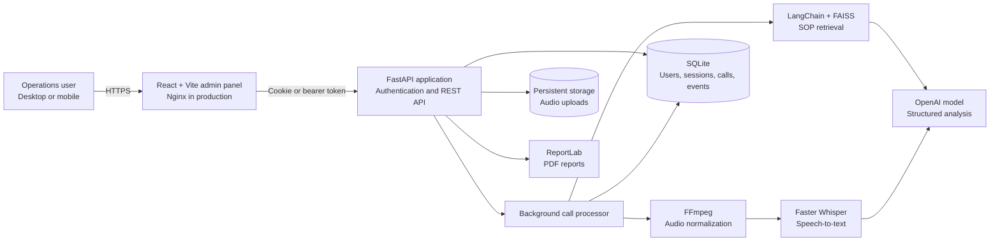
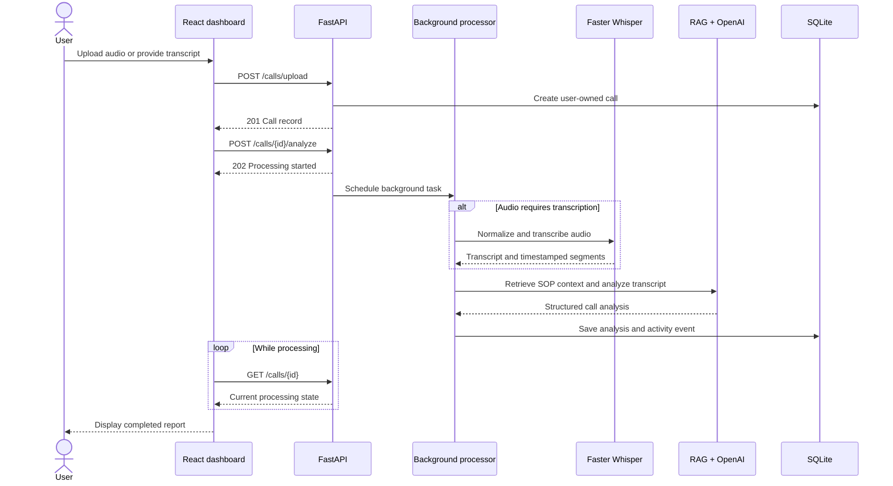

# Contender Voice Intelligence

Contender Voice Intelligence is a full-stack call analysis platform for operations teams. Authenticated users can upload customer-call recordings, transcribe audio locally with Faster Whisper, generate structured AI analysis with OpenAI and retrieval-augmented generation (RAG), track follow-up activity, and export call reports as PDF or CSV.

The application includes a responsive React administration interface, a FastAPI backend, per-user data isolation, background call processing, SQLite persistence, and Docker deployment support.

## Key capabilities

- Secure registration, login, logout, and seven-day sessions
- Per-user call ownership and protected API endpoints
- MP3, WAV, and M4A uploads up to 25 MB
- FFmpeg audio normalization and Faster Whisper transcription
- Optional transcript submission to skip speech-to-text
- AI classification, prioritization, summaries, missing-information detection, and recommended actions
- SOP-aware analysis using LangChain, OpenAI embeddings, and a FAISS knowledge base
- Background processing with live status updates in the dashboard
- Call search, filtering, editing, workflow statuses, and activity history
- Recording playback and timestamped transcript segments
- Individual PDF reports and complete CSV export
- Responsive desktop and mobile interface
- Dockerized API and Nginx-served React frontend

## System architecture



### Call-processing lifecycle



## Technology stack

| Layer | Technology |
| --- | --- |
| Frontend | React, Vite, Lucide icons, responsive CSS |
| Web server | Nginx (production frontend container) |
| Backend | Python 3.12, FastAPI, Uvicorn, Pydantic |
| Authentication | PBKDF2-SHA256 password hashing, opaque hashed sessions, HTTP-only cookies or bearer tokens |
| Speech processing | FFmpeg, Faster Whisper, CTranslate2 |
| AI analysis | OpenAI, LangChain, structured Pydantic output |
| Knowledge retrieval | FAISS and OpenAI embeddings |
| Database | SQLite |
| Reporting | ReportLab PDF and CSV exports |
| Testing | Pytest and FastAPI TestClient |
| Deployment | Docker Compose, AWS EC2-compatible containers |

## Repository structure

```text
Contender-Voice-Intelligence/
├── data/
│   ├── knowledge_base/       # SOP documents used by RAG
│   ├── test_calls/           # Evaluation fixtures
│   ├── uploads/              # Runtime audio files (ignored by Git)
│   └── contender.db          # Runtime SQLite database (ignored by Git)
├── frontend/
│   ├── src/                  # React application and responsive styling
│   ├── Dockerfile            # Vite build and Nginx runtime
│   └── package.json
├── src/
│   ├── api.py                # FastAPI routes and background workflow
│   ├── auth.py               # Authentication and session handling
│   ├── config.py             # Environment and model configuration
│   ├── database.py           # SQLite schema and data access
│   ├── llm_analyzer.py       # Structured AI analysis
│   ├── pdf_report.py         # Per-call PDF generation
│   ├── rag_engine.py         # Knowledge-base retrieval
│   ├── schemas.py            # API and analysis schemas
│   └── speech.py             # Audio normalization and transcription
├── tests/                    # Backend and schema tests
├── vector_db/                # Persisted FAISS index
├── docker-compose.yml        # Production-oriented service composition
├── Dockerfile                # FastAPI container
├── requirements.txt
└── run-backend.ps1           # Windows backend launcher
```

## Prerequisites

For local development:

- Python 3.10 or newer (Python 3.12 recommended)
- Node.js 20 or newer
- FFmpeg available on `PATH` for audio normalization
- An OpenAI API key for AI analysis and knowledge-base embeddings

Docker users only need Docker Engine with Docker Compose.

## Environment configuration

Create a `.env` file in the repository root:

```env
OPENAI_API_KEY=your_openai_api_key

# Optional performance settings
LLM_MODEL_NAME=gpt-4o-mini
EMBEDDING_MODEL_NAME=text-embedding-3-small
WHISPER_MODEL_NAME=base.en
WHISPER_CPU_THREADS=4
PRELOAD_WHISPER=true

# Comma-separated frontend origins accepted by the API
CORS_ORIGINS=http://localhost:5173,http://localhost:8080
```

Never commit `.env`; it is excluded by `.gitignore`.

## Local development

### 1. Backend

```powershell
python -m venv .venv
.\.venv\Scripts\Activate.ps1
python -m pip install --upgrade pip
pip install -r requirements.txt
.\run-backend.ps1
```

On macOS or Linux, activate with `source .venv/bin/activate` and start the API with:

```bash
uvicorn src.api:app --reload --host 0.0.0.0 --port 8000
```

### 2. Frontend

In a second terminal:

```powershell
cd frontend
corepack enable
pnpm install
pnpm run dev
```

Open:

- Admin panel: `http://localhost:5173`
- API documentation: `http://localhost:8000/docs`
- Health check: `http://localhost:8000/health`

## Docker deployment

The Compose stack builds two services:

- `api`: FastAPI, FFmpeg, Faster Whisper, AI analysis, and persistence
- `admin`: compiled React application served by Nginx

Start the stack:

```bash
docker compose up --build -d
docker compose ps
```

Open the frontend at `http://<server-ip>:8080` and the API at `http://<server-ip>:8000`.

The Compose file uses named volumes:

- `contender-data` persists SQLite and uploaded recordings
- `whisper-cache` persists downloaded Whisper models

The first transcription may take longer while the configured Whisper model is downloaded. Later calls reuse the cached model.

### Production URL configuration

Before building, set both URLs to the public hostname or IP:

```yaml
services:
  api:
    environment:
      CORS_ORIGINS: https://voice.example.com
  admin:
    build:
      args:
        VITE_API_URL: https://api.voice.example.com
```

`VITE_API_URL` is embedded during the frontend build. Rebuild the `admin` image whenever it changes.

## AWS EC2 deployment overview

1. Launch an Ubuntu EC2 instance with sufficient CPU and memory for the selected Whisper model.
2. Allow inbound SSH from your IP and expose ports `8080` and `8000`, or preferably only `80` and `443` through a reverse proxy.
3. Install Git, Docker Engine, and the Docker Compose plugin.
4. Clone the repository and create the server-side `.env` file.
5. Configure `CORS_ORIGINS` and `VITE_API_URL` with the public domain.
6. Run `docker compose up --build -d`.
7. Verify `curl http://localhost:8000/health` on the instance.
8. Add HTTPS using an Application Load Balancer, Caddy, Nginx, or another TLS-terminating proxy.

For production, use a domain and HTTPS instead of exposing the raw API port publicly. Restrict the EC2 security group to only the ports that are required.

## API overview

| Method | Endpoint | Purpose |
| --- | --- | --- |
| `GET` | `/health` | Service health check |
| `POST` | `/auth/register` | Create an account and session |
| `POST` | `/auth/login` | Authenticate a user |
| `POST` | `/auth/logout` | Invalidate the current session |
| `GET` | `/auth/me` | Return the current user |
| `POST` | `/calls/upload` | Upload an audio recording |
| `POST` | `/calls/{call_id}/analyze` | Start background transcription and analysis |
| `GET` | `/calls` | List calls owned by the current user |
| `GET` | `/calls/{call_id}` | Get one call and its analysis |
| `PATCH` | `/calls/{call_id}/analysis` | Edit structured analysis fields |
| `PATCH` | `/calls/{call_id}/status` | Update workflow status |
| `GET` | `/calls/{call_id}/events` | Get the call activity history |
| `GET` | `/calls/{call_id}/audio` | Stream the protected recording |
| `GET` | `/calls/{call_id}/export.pdf` | Download a detailed PDF report |
| `GET` | `/calls/export.csv` | Download all visible calls as CSV |

Except for health and authentication entry points, routes require a valid session and enforce call ownership.

## Performance tuning

- Use `tiny.en` for the fastest English transcription on lower-powered CPUs.
- Use `base.en` for a practical speed/accuracy balance.
- Use `small.en` for improved accuracy with higher CPU and memory requirements.
- Keep `PRELOAD_WHISPER=true` to load the speech provider during API startup.
- Increase `WHISPER_CPU_THREADS` only when the host has available CPU cores.
- Submit an existing transcript to bypass speech-to-text for the fastest report generation.
- Keep the Whisper cache volume mounted so the model is not downloaded after every deployment.

The current background-task implementation is suitable for a single application instance. For horizontal scaling or high call volume, move processing to a durable task queue such as Celery, RQ, or AWS SQS with dedicated workers, and migrate persistence from SQLite to PostgreSQL.

## Testing

Run the automated test suite from the repository root:

```powershell
.\.venv\Scripts\python.exe -m pytest -q
```

Run the transcript evaluation suite with:

```powershell
.\.venv\Scripts\python.exe -m src.evaluator
```

## Health checks and troubleshooting

Check the API directly:

```bash
curl http://localhost:8000/health
```

Inspect Docker services and logs:

```bash
docker compose ps
docker compose logs -f api
docker compose logs -f admin
```

Common issues:

- **Blank page after login:** confirm `VITE_API_URL` was correct when the frontend image was built and that `CORS_ORIGINS` exactly matches the browser origin.
- **Missing `langchain_openai` or `langchain_community`:** activate the project virtual environment and run `pip install -r requirements.txt`.
- **Transcription unavailable:** ensure Faster Whisper is installed and FFmpeg is available. Both are included in the API Docker image.
- **Slow first analysis:** the first request may download and initialize the Whisper model and create or load the vector index.
- **Calls remain in processing:** inspect API logs and the call's `processing_error` value through the API or dashboard.
- **PDF export returns 401:** export requests must include the authenticated session cookie or bearer token.

## Security and operational boundaries

- Passwords are salted and hashed with PBKDF2-SHA256; plaintext passwords are never stored.
- Session tokens are stored only as SHA-256 hashes and expire after seven days.
- Calls, recordings, events, and exports are scoped to their owning user.
- Uploaded files are validated by extension and size.
- The system provides decision support only. Staff must review AI output before making commitments, pricing decisions, callbacks, or operational changes.
- For internet-facing production deployments, add HTTPS, secure cookie settings, rate limiting, managed secrets, centralized logging, backups, and a production database.

## License

No open-source license has been declared. All rights are reserved unless the repository owner adds a license file.
